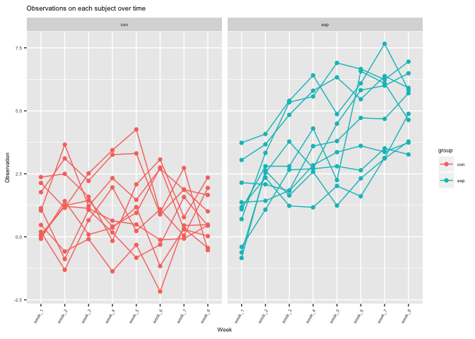
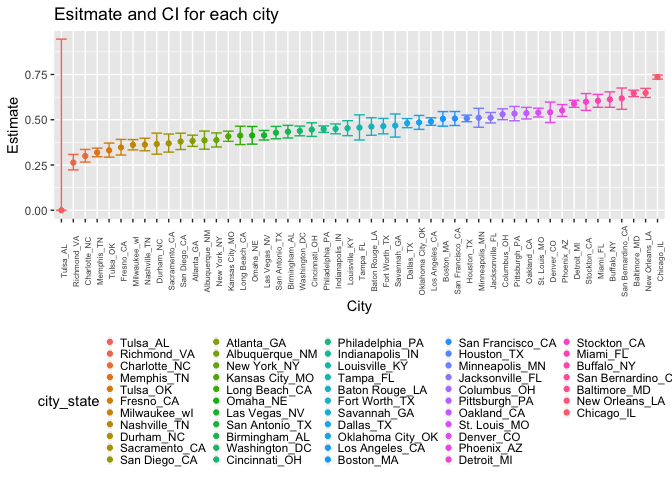

p8105\_hw5\_hn2339
================
Haowei Ni
2018/11/4

``` r
library(tidyverse)
```

    ## ─ Attaching packages ──────────────────────── tidyverse 1.2.1 ─

    ## ✔ ggplot2 3.0.0     ✔ purrr   0.2.5
    ## ✔ tibble  1.4.2     ✔ dplyr   0.7.7
    ## ✔ tidyr   0.8.1     ✔ stringr 1.3.1
    ## ✔ readr   1.1.1     ✔ forcats 0.3.0

    ## ─ Conflicts ────────────────────────── tidyverse_conflicts() ─
    ## ✖ dplyr::filter() masks stats::filter()
    ## ✖ dplyr::lag()    masks stats::lag()

``` r
library(dplyr)
library(stringr)
library(readr)
```

Question 1
----------

``` r
## read all the files in the data 
names = list.files(path = "./data/Con_Exp/")
path = str_c("./data/Con_Exp/", names)
## combine all files into one dataframe 
con_exp =
  tibble(test_subject = names) %>% 
  mutate(data = map(path, read_csv)) %>% 
  unnest()
## tidy the data 
con_exp = janitor::clean_names(con_exp) %>% 
   mutate(test_subject = str_replace(test_subject, ".csv", "")) %>% 
   separate(test_subject, into = c("group", "id"), sep = "_") %>% 
   mutate(id = as.factor(id), 
          group = as.factor(group))
## make spaghetti plot
  con_exp %>% 
  gather(key = week, value = observation, week_1:week_8) %>% 
  ggplot(aes(x = week, y = observation, color = group, group = id)) +
    geom_line() + 
    geom_point() +
  facet_grid(~group) +
  ggtitle("Observations on each subject over time") +
  theme(text = element_text(size = 6), axis.text.x = element_text(angle = 60, hjust = 1)) + 
  labs(x = "Week",
       y = "Observation")
```

 From this spaghetti plot, the experimental group arm has generally higher data than control group arm. In week 1, the observation difference between control and experimental group is small. But in week 8, all subjects in the experimental group has higher observation compared to the control group. Subjects in the experimental group has generall increasing observation data. However, in the control group, the difference between week 1 and week 8 is very small.

Question 2
----------

``` r
homicide =  read_csv("data/homicide-data.csv") %>% 
  janitor::clean_names()
```

    ## Parsed with column specification:
    ## cols(
    ##   uid = col_character(),
    ##   reported_date = col_integer(),
    ##   victim_last = col_character(),
    ##   victim_first = col_character(),
    ##   victim_race = col_character(),
    ##   victim_age = col_character(),
    ##   victim_sex = col_character(),
    ##   city = col_character(),
    ##   state = col_character(),
    ##   lat = col_double(),
    ##   lon = col_double(),
    ##   disposition = col_character()
    ## )

There are totally 12 variables and 52179 objects in the data set. Variables tell the reported date, victim's name, race, age, sex, exact location and disposition.

Creat a new variable

``` r
homicide = 
  homicide %>% 
  mutate(city_state = str_c(city, state, sep = "_")) 
```

Get total number of homicides and the number of unsolved homicides

``` r
Count_number = 
  homicide %>%
  ## get total number of homicides and the number of unsolved homicides
  group_by(city_state) %>% 
  nest() %>%
  mutate(total_number = map(.x = data, ~ count(.x)), 
         unsolved = map(.x = data, ~.x %>% 
                        filter(disposition %in% c("Closed without arrest","Open/No arrest")) %>% count())) %>% 
  select(city_state, total_number, unsolved) %>% 
  unnest() %>% 
  rename(total_number = n, unsolved = n1)
```

Estimate proportion and confidence interval

``` r
Baltimore = Count_number %>% 
  filter(city_state == "Baltimore_MD")  
  prop.test(Baltimore$unsolved, Baltimore$total_number) %>% 
  broom::tidy() %>% 
  select(estimate, conf.low, conf.high)
```

    ## # A tibble: 1 x 3
    ##   estimate conf.low conf.high
    ##      <dbl>    <dbl>     <dbl>
    ## 1    0.646    0.628     0.663

``` r
  Proportion = map2(.x = Count_number$unsolved, .y = Count_number$total_number, ~ prop.test(.x, .y)) 
```

    ## Warning in prop.test(.x, .y): Chi-squared approximation may be incorrect

``` r
  Proportion_df = map_df(.x = Proportion, ~ .x %>% broom::tidy(.x) %>% select(estimate, conf.low, conf.high)) %>% 
  mutate(city_state = Count_number$city_state) %>% 
  select(city_state, estimate, conf.low, conf.high)
```

Make a plot

``` r
  Proportion_df %>% 
  mutate(city_state = fct_reorder(city_state, estimate)) %>% 
  ggplot(aes(x = city_state, y = estimate, color = city_state)) + 
  geom_point() +
  geom_errorbar(aes(ymin = conf.low, ymax = conf.high)) + 
  ggtitle("Esitmate and CI for each city ") +
  theme(legend.position = "bottom",
        legend.direction = "horizontal",
        axis.text.x = element_text(angle = 90, size = 6),
        legend.key.size = unit(0.05, "cm")) + 
  labs(x = "City",
       y = "Estimate") 
```


